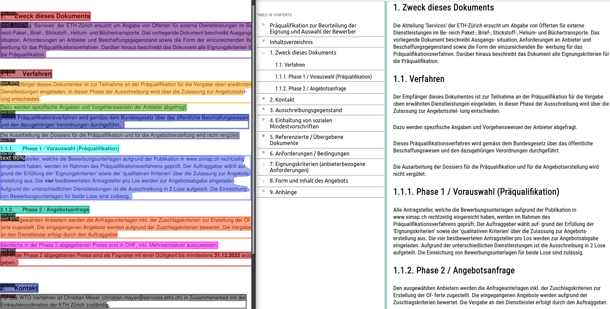

<p align="center">

</p>

# Table of Contents
- [Diard Introduction](#diard-introduction)
- [Environment Setup](#environment-setup)
- [Directory Structure](#directory-structure)

## Diard Introduction
Diard is a document image analysis pipeline which extracts semi-structured Analysis Ready Data from your Document's Images. To achieve this, a state-of-the-art layout detection model is used ([DiT](https://github.com/microsoft/unilm/tree/master/dit)) to extract document objects (i.e., title, text, list, figure,...). These objects are then used to segment the sections (i.e., Table Of Contents, Introduction,...) and to find the information needed to obtain a semi-structured version of your document.

## Environment Setup
First, clone the repository and use the [installation.md](docs/installation.md) file as an installation guide.

```bash
git clone https://github.com/thibaultvt/Diard.git
cd Diard
```

## Directory Structure

```tree
Diard
│   │
│   main.py                                 # The document image analysis pipeline
│   requirements.txt                        # List of required Python libraries
│   README.md                               # This file
│
+---ditod                                   # Microsoft's DiT modules
|
+---modules
│   │
│   │   utils.py                            # Non-class specific functions
│   │   document.py                         # Document class definition
│   │   exceptions.py                       # Custom exceptions
│ 
+---docs
│   │
│   │   installation.md                     # Environment setup guide
│ 
+---resources
│   │
│   │   stylesheet.css                      # Stylesheet for HTML visualization
│   │   stylescript.js                      # Style script for HTML visualization
│   │
│   +---images                              # Images used in README.md
│   │
│   +---model_configs                       # Configuration files for DiT
│   │
│   +---pdfs                                # To be processed pdfs
│   │   │   example.pdf
│   │   │   ...
│   │
│   +---weights                             # Storage for pre-trained model weights
│       │   publaynet_dit-l_cascade.pth     # Weight used in initial release
│       │   ...
│
+---output                                  # Default output dir (created by pipeline)
    │
    +---example                             # Directory for each PDF you process
        │    
        +---html                            # Storage for HTML visualizations    
        │
        +---jsons                           # Storage for doc layout JSON files
        │ 
        +---visualizations                  # Storage for detection visualizations
```


### TODO
* [ ] add support for word documents
* [ ] add script for multiple documents and test
* [ ] use of absolute paths for dir structure independence
* [ ] add jupyter notebook examples
* [ ] add docs where you explain all the methods and functionality and how you can extend the project + how you can use it with section clustering pipeline when that is finished
* [ ] add Manhattan layout support (layout ordering)
* [ ] add support for the English language
* [ ] add support for the French language
* [ ] add language detection

