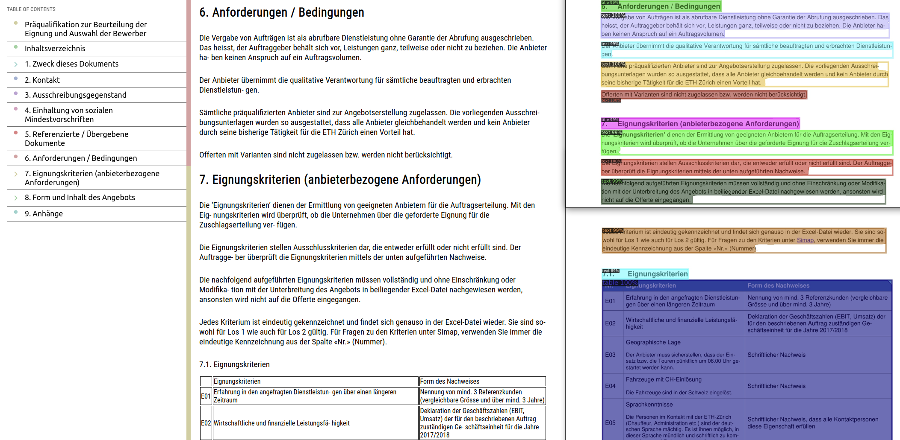

<p align="center">

</p>

# Table of Contents
- [Diard Introduction](#diard-introduction)
- [Environment Setup](#environment-setup)
- [Directory Structure](#directory-structure)

## Diard Introduction

<p align="center">

</p>

Diard is a document image analysis pipeline to extract semi-structured Analysis Ready Data from your Document's Images. To achieve this, the state-of-the-art layout detection model is used ([DiT](https://github.com/microsoft/unilm/tree/master/dit)) to extract document objects (e.g., title, text, list, figure,...) along with [table-transformer](https://github.com/microsoft/table-transformer) for table extraction. These objects are then used to segment the sections (e.g., Table Of Contents, Introduction,...) and to find the information needed to obtain a semi-structured version of your document. The pipeline output can be exported as HTML for evaluation and as JSON for text analysis.

## Environment Setup (MacOS, Linux)
First, clone the repository and use the [setup guide](docs/setup_guide.md) to run things locally.

```bash
git clone https://github.com/thibaultvt/Diard.git
cd Diard
```

## Running Locally
If you just want to test the pipeline, go ahead and use the following command to run the example script.

```bash
python main.py
```

After runnnig the above command, you should see output similar to the one below in your terminal.

```bash
Processing 'example':   0%|                              | 0/8 [00:00<?, ?it/s]
2022-05-16 09:46:34,138 | INFO: Language detection successful! Language is now set to German (deu).
Processing 'example':  12%|█████████████████▎            | 1/8 [00:03<00:25,  3.61s/it]
```

For more detailed explanations on how the pipeline can be used, you can refer to the [examples](docs/examples.md). Please note that the main Python script should always be ran from the root of the repository.

## Directory Structure

```tree
Diard
│   
│   main.py                                 # The document image analysis pipeline
│   requirements.txt                        # List of required Python libraries
│   README.md                               # This file
│   LICENCSE                                # Apache 2.0 License
│
+---ditod                                   # Microsoft's DiT modules
+---detr                                    # Microsoft's DETR modules
|
+---modules
│   │
│   │   document.py                         # Document class definition
│   │   exceptions.py                       # Custom exceptions
│   │   layoutdetection.py                  # Layout detection classes & functions
│   │   sections.py                         # Section segmentation related functions
│   │   export.py                           # Export/ evaluation related methods (HTML, JSON) 
│   │   tables.py                           # Table extraction classes & functions
│ 
+---docs
│   │
│   │   setup_guide.md                      # Environment setup guide
│   │   examples.md                         # Example code with detailed explanations
│ 
+---resources
│   │
│   │   stylesheet.css                      # Stylesheet for HTML visualization
│   │   stylescript.js                      # Style script for HTML visualization
│   │   structure_config.json               # Default args for table extraction
│   │
│   +---images                              # Images used in docs & README
│   │
│   +---model_configs                       # Configuration files for DiT
│   │
│   +---pdfs                                # To be processed pdfs
│   │   │   example.pdf
│   │   │   ...
│   │
│   +---doc_images                          # Example document images
│   │   │   1.jpg 
│   │   │   2.jpg 
│   │   │   ...
│   │
│   +---weights                             # Storage for pre-trained model weights
│       │   publaynet_dit-l_cascade.pth     # Weights used in initial release (layout detection)
│       │   pubtables1m_structure_de...     # Weights used in initial release (table extraction)
│
+---output                                  # Default output dir (created by pipeline)
    │
    +---example                             # Directory for each PDF you process
        │    
        +---html                            # Storage for HTML visualizations    
        │
        +---jsons                           # Storage for doc layout JSON files
        │ 
        +---visualizations                  # Storage for detection visualizations
```

## Issues
* [ ] ordering doesn't always work for layouts consisting of a varying number of columns
* [ ] table extraction only works for consistent tables (no varying number of rows / columns per row / column)
* [ ] OCR is unable to extract single digits,- could be fixed by setting a different Page Segmentation Method ([PSM](https://pyimagesearch.com/2021/11/15/tesseract-page-segmentation-modes-psms-explained-how-to-improve-your-ocr-accuracy/))
