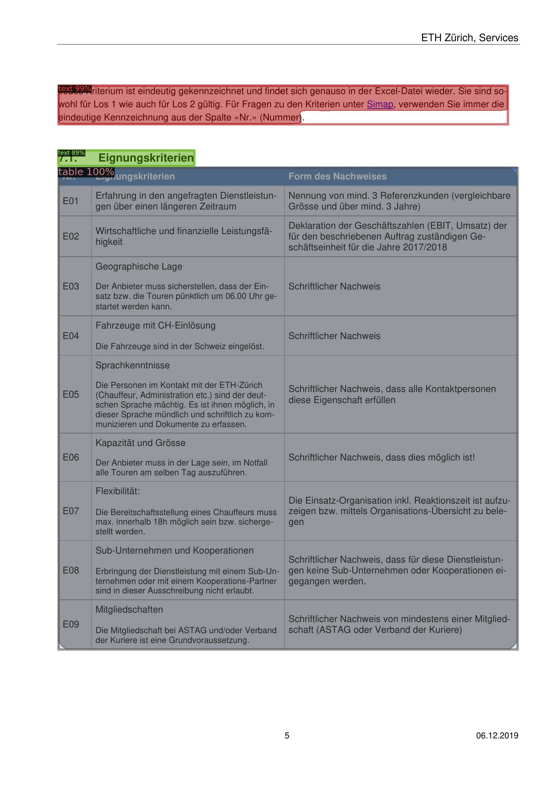
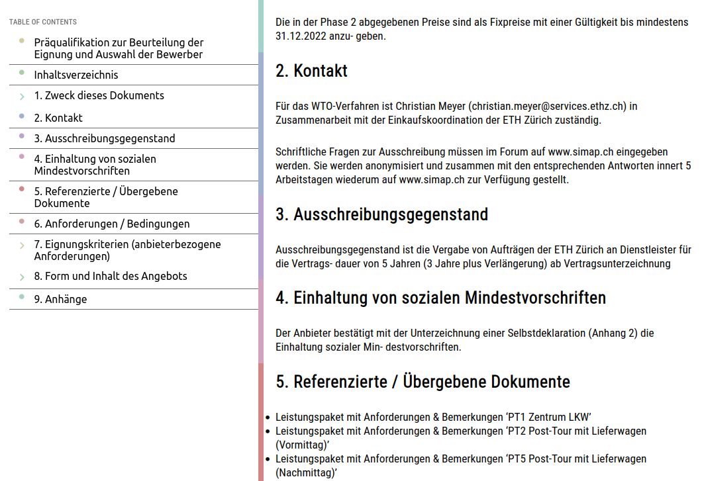

# Table of Contents
- [Examples Introduction](#examples-introduction)
- [x](#x)

## Examples Introduction
In this document all the pipeline's functionalities are explained with code examples. If the main example didn't fulfil your document analysis wishes, then hopefully this guide will help you with that.

## Processing A Single / Multiple Document (PDF)
Processing a single or multiple documents is probably the most common use case of this pipeline. That's why we decided to use this as the main example [main.py](../main.py). We recommend you to first take a look at the [main.py](../main.py) file to get an idea of the workflow because every example below builds from this source code.

First make sure that you set the device to either 'cpu' or 'cuda', depending on your hardware setup and PyTorch installation.

```python
device='cuda', # change to cpu if you don't have CUDA enabled GPU
```

The first ~33 lines initialize the layout detection model.

Then the languages used in the document(s) you're working with are specified. Note that every language you specify should be in your language pack (tessdata) folder or installed as specified in the [installation guide](setup_guide.md). If you're working with documents in written in different languages, you probably want to enable the language detection when creating a Document object instance as we did in the example. We recommend that you also add a list of language codes to help the language prediction if you know the languages used in your documents.

```python
lang = "deu"  
langs = ["eng", "fra", "deu"]  
```

Next, you can either choose to process a single or multiple documents. If you want to process a single document, just uncomment the following line.

```python
#   process single pdf
filenames = ["example.pdf"]
```

And comment out the line after that.

```python
#   process multiple pdfs
#filenames = os.listdir(source_dir)
```

To process multiple documents you can just leave the [main.py](../main.py) file as is, or do the above procedure vice-versa.

Lastly, we loop over the given document paths, create a Document object instance, and run certain pipeline operations.

```python
for filename in filenames:
    doc_path = source_dir + filename
        
    doc = Document(
        doc_path,
        predictor=predictor,
        metadata=metadata,
        lang=lang,
        lang_detect=True,
        langs=langs
    )

    #   extract & export layouts
    doc.doc_to_images()
    doc.extract_layouts(visualize=True, segment_sections=True)
    doc.order_layouts()
    doc.save_layouts_as_json()
    doc.save_layouts_as_html()
```

When working with documents (e.g., PDF), the document's pages first need to be converted to images. For this we use the 'doc_to_images' method. Is your document already in image format? No worries, we got you covered in the [next section](#using-images-instead-of-documents)

```python
doc.doc_to_images()
```

After obtaining the image representation of our document, the layout can be extracted using the 'extract_layouts' method. There are two parameters which you can set, namely, 'visualize' and 'segment_sections'. Setting 'visualize' to True will save the layout detection visualizations. The image below should give you an idea of what this could like.

<p align="center">

</p>

The second parameter, segment_sections, will try to predict which document objects belong to which section or chapter of your document (e.g., Introduction or Table of Contents). After [exporting](#json--html-export) the results as HTML you'll be able to evaluate the section segmentation predictions.

```python
doc.extract_layouts(visualize=True, segment_sections=True)
```

Next, you can order the layout. Meaning that the detected document objects will be ordered in reading order. We currently support layouts with up to three columns, like you would have in a news paper or something.

If you previously set 'section_segmentation' to True, then you don't have to add this line since the layouts will be ordered for the section segmentation algorithm to work properly.

```python
doc.order_layouts()
```

Lastly, you can [export](#json--html-export) your document reproduced in HTML or JSON format. We recommend to use HTML for evaluation, and JSON for further text analysis. When exporting as HTML, you'll get a representation similar to the following example.

<p align="center">

</p>

If you set 'section_segmentation' to True, and either page numbering or headings of varying size are used in your document, then you should get a table of contents which you can use to navigate through the pipeline output per section. Note that the segmentation is far from perfect and only works in the previously listed scenarios.

## Using Images Instead of Documents
TODO: talk about how you can order your pages by using name numbering

## JSON / HTML Export
TODO: add link to example on loading from JSON for text analysis

## Loading Layouts From JSON

## Output Directory Structure

## Enabling Table Extraction
TODO: make sure you have installed the table-transformer pre-trained weights