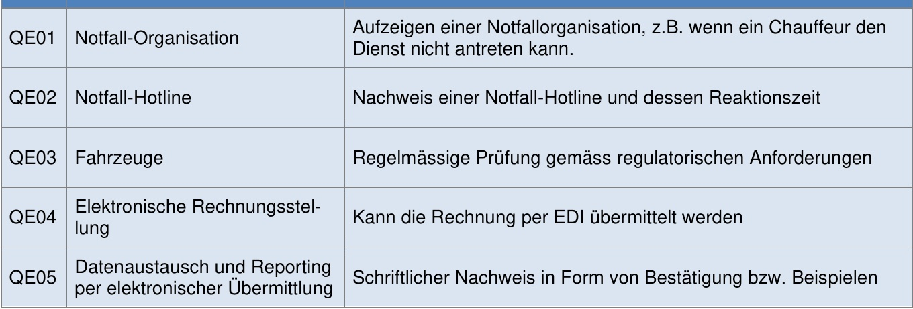
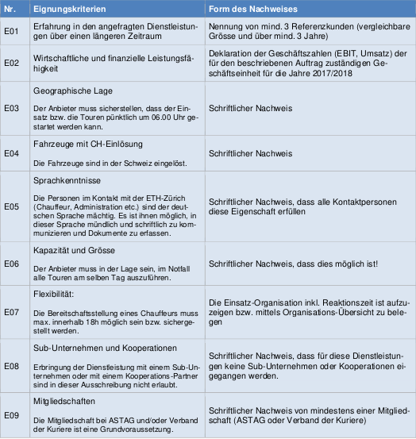
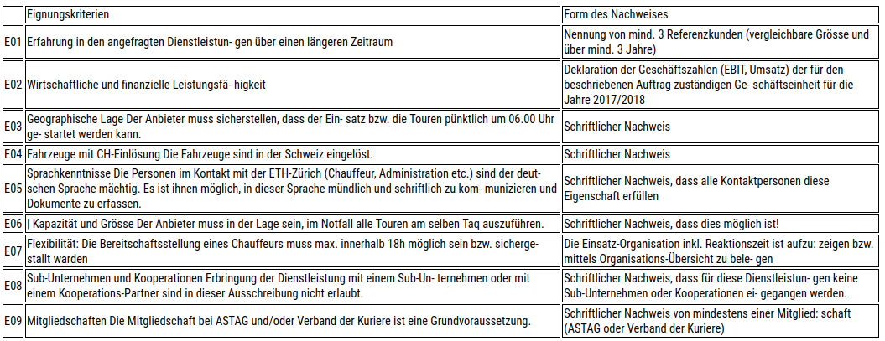

# Table of Contents
- [Examples Introduction](#examples-introduction)
- [Processing A Single / Multiple Document (PDF)](#processing-a-single--multiple-document-pdf)
- [Using Images Instead of Documents](#using-images-instead-of-documents)
- [JSON / HTML Export](#json--html-export)
- [JSON Format](#json-format)
- [Loading Layouts From JSON](#loading-layouts-from-json)
- [Output Directory Structure](#output-directory-structure)
- [Enabling Table Extraction](#enabling-table-extraction)

## Examples Introduction
In this document all the pipeline's functionalities are explained with code examples. If the main example didn't fulfil your document analysis wishes, then this guide should solve that!

## Processing A Single / Multiple Document (PDF)
Processing a single or multiple documents is probably the most common use case of this pipeline. That's why we decided to use this as the main example [main.py](../main.py). We recommend you to first take a look at the [main.py](../main.py) file to get an idea of the workflow because every example below builds from this source code.

First make sure that you set the device to either 'cpu' or 'cuda', depending on your hardware setup and PyTorch installation.

```python
device='cuda', # change to cpu if you don't have CUDA enabled GPU
```

The first ~33 lines initialize the layout detection model.

Then the languages used in the document(s) you're working with are specified. Note that every language you specify should be in your language pack (tessdata) folder or installed as specified in the [installation guide](setup_guide.md). If you're working with documents in written in different languages, you probably want to enable the language detection when creating a Document object instance as we did in the example. We recommend that you also add a list of language codes to help the language prediction if you know the languages used in your documents.

```python
lang = "deu"  
langs = ["eng", "fra", "deu"]  
```

Next, you can either choose to process a single or multiple documents. If you want to process a single document, just uncomment the following line.

```python
#   process single pdf
filenames = ["example.pdf"]
```

And comment out the line after that.

```python
#   process multiple pdfs
#filenames = os.listdir(source_dir)
```

To process multiple documents you can just leave the [main.py](../main.py) file as is, or do the above procedure vice-versa.

Lastly, we loop over the given document paths, create a Document object instance, and run certain pipeline operations.

```python
for filename in filenames:
    doc_path = source_dir + filename
        
    doc = Document(
        doc_path,
        predictor=predictor,
        metadata=metadata,
        lang=lang,
        lang_detect=True,
        langs=langs
    )

    #   extract & export layouts
    doc.doc_to_images()
    doc.extract_layouts(visualize=True, segment_sections=True)
    doc.order_layouts()
    doc.save_layouts_as_json()
    doc.save_layouts_as_html()
```

When working with documents (e.g., PDF), the document's pages first need to be converted to images. For this we use the 'doc_to_images' method. Is your document already in image format? No worries, we got you covered in the [next section](#using-images-instead-of-documents).

```python
doc.doc_to_images()
```

After obtaining the image representation of our document, the layout can be extracted using the 'extract_layouts' method. There are two parameters which you can set, namely, 'visualize' and 'segment_sections'. Setting 'visualize' to True will save the layout detection visualizations. The image below should give you an idea of what this could like.

<p align="center">

</p>

The second parameter, segment_sections, will try to predict which document objects belong to which section or chapter of your document (e.g., Introduction or Table of Contents). After [exporting](#json--html-export) the results as HTML you'll be able to evaluate the section segmentation predictions.

```python
doc.extract_layouts(visualize=True, segment_sections=True)
```

Next, you can order the layout. Meaning that the detected document objects will be ordered in reading order. We currently support layouts with up to three columns, like you would have in a news paper or something.

If you previously set 'section_segmentation' to True, then you don't have to add this line since the layouts will be ordered for the section segmentation algorithm to work properly.

```python
doc.order_layouts()
```

Lastly, you can [export](#json--html-export) your document reproduced in HTML or JSON format. We recommend to use HTML for evaluation, and JSON for further text analysis. When exporting as HTML, you'll get a representation similar to the following example.

<p align="center">

</p>

If you set 'section_segmentation' to True, and either page numbering or headings of varying size are used in your document, then you should get a table of contents which you can use to navigate through the pipeline output per section. Note that the segmentation is far from perfect and only works in the previously listed scenarios.

One more thing. We also support [table extraction](#enabling-table-extraction) but it's not enabled by default. If you don't enable table extraction, they will be stored and displayed as figures.

## Using Images Instead of Documents
You can also use document images as input to the pipeline. This can be done by making the following changes.

First, set a variable containing the path to the directory with document images. Before proceeding you should make sure that the directory contains only images and nothing else. 

For example:

```python
source_dir = './resources/doc_images'
```

The above variable now points to our example document images. If you took a look into the doc_images directory, you might have noticed that the image filenames are numbers (e.g. '1.jpg', '2.jpg', ..., 'n.jpg'). You should do the same if you want your document reproduction to be in the original order. If they are not numbered, the JSON and HTML output files will have the same filename with a different extension.

Next, create a Document object instance with the parameter 'use_images' set to True.

```python
doc = Document(
            source_dir,
            predictor=predictor,
            metadata=metadata,
            lang=lang,
            lang_detect=True,
            langs=langs,
            use_images=True
        )
```

Lastly, compose the pipeline with all the steps you want. 

For example:

```python
doc.extract_layouts(visualize=True, segment_sections=True)
doc.save_layouts_as_html()
```

## JSON / HTML Export
There are two export / saving options, namely, as JSON and as HTML. The HTML representation is the more interesting option for evaluation or showcasing, and the JSON format is better for analysing purposes. TODO: here you should link to loading from JSON for text analysis

Exporting each page separately along with a file containing the whole document can be done with the following Document object methods for JSON and HTML export respectively.

```python
doc.save_layouts_as_json()
doc.save_layouts_as_html()
```

To export only a single document page, the following methods can be used where the page number is the only parameter. Please note that the 's' is removed from 'layouts'.

```python
doc.save_layout_as_json(4)
doc.save_layout_as_html(4)
```

### JSON Format
The document data is exported as JSON in the following format.

JSON files representing a single document page are structured as explained below.

**Text & Titles**
```json
{
    "id": 0,
    "type": "title",
    "content": "Inhaltsverzeichnis\n\f",
    "box": [
      589,
      298,
      1119,
      378
    ],
    "page": 1,
    "section": 2
  }
```

**Lists** (list items separated by '\n')
```json
{
    "id": 5,
    "type": "list",
    "content": "Leistungspaket mit Anforderungen & Bemerkungen ‘PT1 Zentrum LKW’\n\nLeistungspaket mit Anforderungen & Bemerkungen ‘PT2 Post-Tour mit Lieferwagen (Vormittag)’",
    "box": [
      223,
      755,
      1480,
      948
    ],
    "page": 3,
    "section": 7
}
```

**Figures** (relative path to cropped image from HTML and JSON output directories)
```json
{
    "id": 2,
    "type": "figure",
    "content": "../figures/4-0_table.jpg",
    "box": [
      172,
      497,
      1533,
      1924
    ],
    "page": 4,
    "section": 9
}
```

**Tables** (if table extraction is enabled, otherwise processed like figures)
```json
{
      "id": 2,
      "type": "table",
      "content": {
        "0": {
          "0": "QEO1 \f",
          "1": "QEO2 \f",
          "2": "QEO3 \f",
          "3": "QEO4A \f",
          "4": "QEO5 \f"
        },
        "1": {
          "0": "Notfall-Organisation \f",
          "1": "Notfall-Hotline \f",
          "2": "Fahrzeuge \f",
          "3": "Elektronische Rechnungsstel- lung \f",
          "4": "Datenaustausch und Reporting per elektronischer Übermittlung \f"
        },
        "2": {
          "0": "Aufzeigen ei Dienst nicht : \f",
          "1": "Nachweis eir \f",
          "2": "Regelmässig \f",
          "3": "Kann die Reı \f",
          "4": "Schriftlicher | \f"
        }
      },
      "box": [
        172,
        575,
        1532,
        1037
      ],
      "page": 5,
      "section": 9
}
```

Which represents a part of the table below.

<p align="center">

</p>


## Loading Layouts From JSON
Let's say you want to order and export your layout as HTML after having already done the layout detection part of the pipeline.

You can do this by doing the following. First, a Document object instance should be created with the doc_path parameter being the path to the original document or document images directory.

```python
doc_path = "./resources/pdfs/example.pdf"

doc = Document(
        source_path=doc_path
    )
```

Next, call the 'load_layout_from_json' method with the path to the JSON file as the only parameter. Lastly, compose the rest of the pipeline to order and export the layouts.

```python
json_path = "./output/example/jsons/example.json"

doc.load_layout_from_json(json_path)
doc.order_layouts()
doc.save_layouts_as_html()
```

## Output Directory Structure
After exporting your results as JSON and/ or HTML you can find them in the output directory. Within the output directory you should see a directory named after your document which will contain the HTML, JSON, and visualization files.

The only exception to this is the use of images instead of a document. Then the output directory name will be the name of the directory containing the document images.

```tree
output
│   
+---example                                 # Directory for each PDF you process
    │
    │    
    +---html                                # Storage for HTML visualizations    
    │
    +---jsons                               # Storage for doc layout JSON files
    │ 
    +---visualizations                      # Storage for detection visualizations
```

## Enabling Table Extraction
By default tables are processed like figures. They are cropped out of the original document image and saved for reproduction in HTML. But the pipeline also supports the reproduction of tables as a dataframe.

When reproducing the extracted table in HTML it looks like this (bottom image). 

<p align="center">

</p>

<p align="center">

</p>

For the table JSON format you should look at the [export section](#json--html-export).

Now, how do you enable the table extractor? First, you should make sure that you followed the [guidelines](setup_guide.md#step-81---optional-table-extraction) to set up your environment with the intentions of using the table extractor.

If you have the pre-trained model in place, you can make the following changes to your code in order to enable the table extractor.

First, obtain the table predictor or model.

```python
table_weights_path = "./resources/weights/pubtables1m_structure_detr_r18.pth"
table_predictor = TableExtractor(table_weights_path, device='cpu')
```

Note that you can set a different device for the table extractor model. This might come in handy for people who have only a small amount of GPU memory.

Next, add the table predictor to the list of parameters when creating a new Document object instance.

```python
doc = Document(
    doc_path,
    predictor=predictor,
    metadata=metadata,

    table_predictor=table_predictor,

    lang=lang,
    lang_detect=True,
    langs=langs,
    )
```

## Using JSON for Further Analysis
In the root of the directory you'll find a script that shows how you can use the Diard pipeline output for further analysis. Don't forget to add the file location of the JSON file that you want to process by setting the '--json-path' argument.

```bash
# from root of repo run
python load_from_json.py --json-path output/example/jsons/example.json
```

Let's go over the script and discuss what else you could add.

First, we load the document objects from the JSON file using the 'load_layout_from_json' function. The only parameter we need to pass to this function, is the path to the JSON file. Whether the JSON file contains layout information representing a single page or a whole document, will be figured out by the algorithm. Which blocks or document objects belong to the same page can still be deduced from the 'page' key / value pair of the block's dictionary, so don't worry if that's what you're looking for.

```python
blocks = load_layout_from_json(args.json_path)
```

The blocks variable will contain a list of dictionaries with the following structure.

```python
{
  'id': 2, 
  'type': 'text',
  'content': 'This is example text.',
  'box': [174, 1719, 850, 1770], 
  'page': 0, 
  'section': 1  # only present if section segmentation was used
}
```

As long as you know how a Python [dictionary](https://www.w3schools.com/python/python_dictionaries.asp) works, you can do anything you want with this data.

Using the individual key / value pairs would look like this. Note that we put a try clause around the section's print statement because this pair is only present if section segmentation was used.

```python
is_table = block['type'] == 'table'
is_dict = type(block['content']) == dict
for k, v in block.items():
  if is_table and is_dict and k == 'content':
    #   resulting variable is not used in this example
    df = pd.DataFrame.from_dict(v)
    #   do what you want with the tabular data...
  elif k == 'content':
    v = v.strip()

  try:
    print(f"{k}: {v}")
  #   catch key / value pair if section segmentation wasn't used
  except KeyError:
    pass
```

### Reading Table Extraction Data From JSON
If you processed your documents with [table extraction](#enabling-table-extraction) enabled, the steps to work with this data are a bit different from the other document objects. We also include these steps in the example by checking if the table was indeed processed with table extraction enabled.

```python
if is_table and is_dict and k == 'content':
  df = pd.DataFrame.from_dict(v)  # or block['content']
  #   next, do what you want with the tabular data...
```

You could also keep the tabular data in its original format, which is a dictionary structured in the following way. The first three keys represent the columns, and the following five keys the rows with the corresponding content as their value.

```python
{
  '0': {
    '0': 'QEO1 \x0c',
    '1': 'QEO2 \x0c',
    '2': 'QEO3 \x0c',
    '3': 'QEO4A \x0c',
    '4': 'QEO5 \x0c'
  }, 
  '1': {
    '0': 'Notfall-Organisation \x0c',
    '1': 'Notfall-Hotline \x0c',
    '2': 'Fahrzeuge \x0c',
    '3': 'Elektronische Rechnungsstel- lung \x0c',
    '4': 'Daten    austausch und Reporting per elektronischer Übermittlung \x0c'
  }, 
  '2': {
    '0': 'Aufzeigen ei Dienst nicht : \x0c',
    '1': 'Nachweis eir \x0c',
    '2': 'Regelmässig \x0c',
    '3': 'Kann die Reı \x0c',
    '4': 'Schriftlicher | \x0c'
  }
}
```
